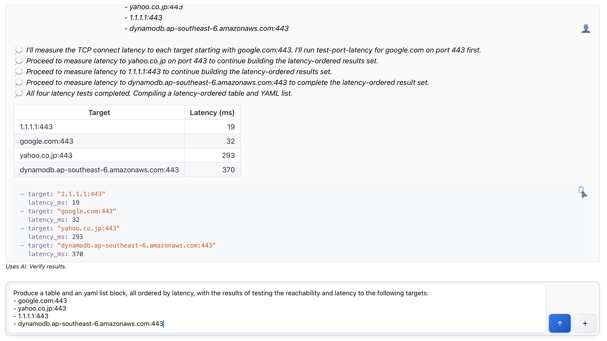
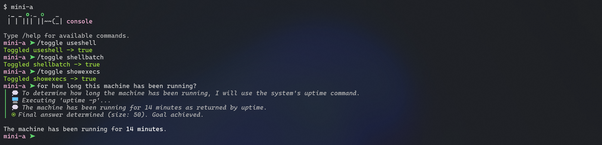

  <h1 class="hero-title">mini-a</h1>
  

  
<i>A minimalist autonomous agent that uses LLMs, shell commands and/or MCP servers to achieve user-defined goals. Simple, flexible, and easy to use as a library, CLI tool, or embedded interface.</i>

  

    <a href="{{ '/getting-started.html' | relative_url }}" class="btn btn-primary">Get Started</a> | 
    <a href="https://github.com/OpenAF/mini-a" class="btn btn-secondary">View on GitHub</a>
  

   

  <h2>See it in Action</h2>
  

    

      
      
<i>Modern Web Interface</i>

    

     
    

      
      
<i>Interactive Console</i>

    

     
  

  <h2>Key Features</h2>
  

    

      <h3>🤖 Multi-Model Support</h3>
      <i>Works with OpenAI, Google Gemini, GitHub Models, AWS Bedrock, Ollama, and more</i>
       
    

    

      <h3>💰 Cost Optimization</h3>
      <i>Dual-model setup with automatic escalation reduces costs by 50-70%</i>
       
    

    

      <h3>🔌 MCP Integration</h3>
      <i>Seamless integration with Model Context Protocol servers (STDIO & HTTP)</i>
       
    

    

      <h3>⚡ Performance</h3>
      <i>Automatic optimizations reduce token usage by 40-60%</i>
       
    

    

      <h3>🛠️ Flexible Tools</h3>
      <i>Shell commands, MCP proxy, built-in utilities, and custom tools</i>
       
    

    

      <h3>🐳 Docker Ready</h3>
      <i>Run in containers for isolated execution and portability</i>
       
    

  

  <h2>Quick Example</h2>
  

    

      <h3>1. Set your model</h3>
      
export OAF_MODEL="(type: openai, model: gpt-4o-mini, key: '...', timeout: 900000)"
      
    

    

      <h3>2. Run the console</h3>
      
opack exec mini-a
      
    

    

      <h3>3. Give it a goal</h3>
      
mini-a goal="list all JavaScript files in this directory" useshell=true
      
    

  

  
💡 <!--em>Suggestion: Add asciinema recording of a complete quick start session here</em-->

  <h2>How it Works</h2>
  

    
    

      
<strong>mini-a</strong> orchestrates between you, LLM models, MCP servers, and optional shell commands:

      <ul>
        <li><strong>User</strong> provides goals and parameters</li>
        <li><strong>LLM Models</strong> handle reasoning and planning (with smart dual-model optimization)</li>
        <li><strong>MCP Servers</strong> provide structured data and specialized tools</li>
        <li><strong>Shell</strong> executes commands when needed (opt-in)</li>
        <li><strong>Orchestrator</strong> manages the flow and delivers final responses</li>
      </ul>
    

  

  <h2>Ready to Get Started?</h2>
  
mini-a is easy to install and use. Get up and running in minutes.

  <a href="{{ '/getting-started.html' | relative_url }}" class="btn btn-primary btn-large">Read the Getting Started Guide</a>

